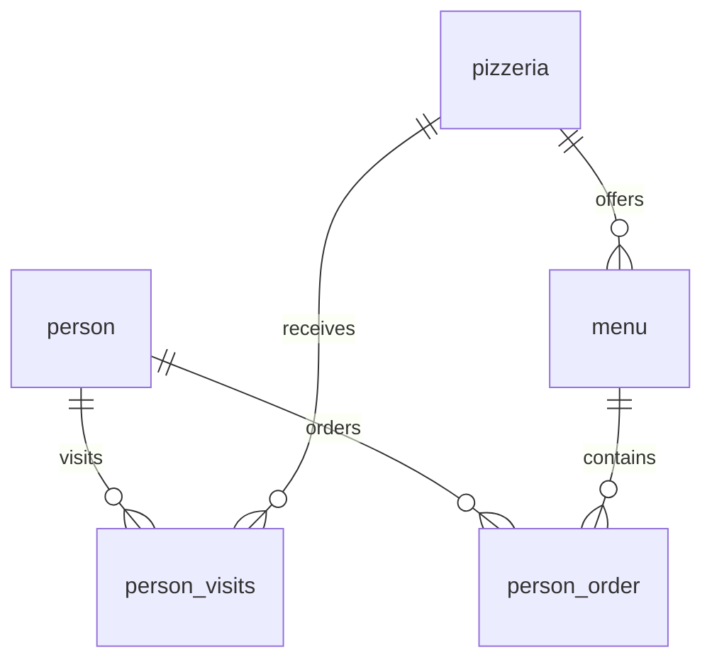

# Демонстрационная база

Схема написана отдельно по таблицам и колонкам, которые используют решения.
`demo/schema.sql` и `demo/seed.sql` не получены из школьного `materials/model.sql`.
Данные синтетические: новые сочетания клиентов, возрастов, городов, рейтингов, цен,
посещений и заказов. Это не реальные персональные данные и не школьный набор.
Некоторые имена, даты и идентификаторы сохранены как литералы совместимости с запросами.
Результаты на этих данных не обязаны совпадать с результатами учебной проверки.

| Таблица | Поля | Назначение |
|---|---|---|
| person | id, name, age, gender, address | Клиенты; address содержит город |
| pizzeria | id, name, rating | Заведения |
| menu | id, pizzeria_id, pizza_name, price | Позиции меню |
| person_visits | id, person_id, pizzeria_id, visit_date | Посещения |
| person_order | id, person_id, menu_id, order_date | Заказы |

В начальном состоянии: 12 клиентов, 5 заведений, 18 позиций меню,
37 посещений и 48 заказов. Есть клиент без заказов/посещений, заведение без посещений,
не заказанные позиции и пропущенные даты. Эти случаи нужны для проверки JOIN и агрегатов.

Идентификатор меню 19 зарезервирован для DML-примера; идентификаторы клиентов 1–12
не имеют пропусков из-за предположения в массовой вставке. Имена клиентов, используемые
в скалярных подзапросах, уникальны в наборе. В реальной схеме эти предположения требуют
отдельного решения. Схема намеренно минимальна и не является моделью промышленной системы.

Запускайте проекты в разных пустых БД: DML, DDL и транзакционные примеры меняют состояние.
Скрипт проверки сам создаёт временный Docker-контейнер без сети, публикации портов и
постоянного тома. Соединение идёт через Unix-сокет внутри контейнера. Пароль генерируется
на время запуска и не сохраняется в файлы или логи. Контейнер удаляется после проверки.
